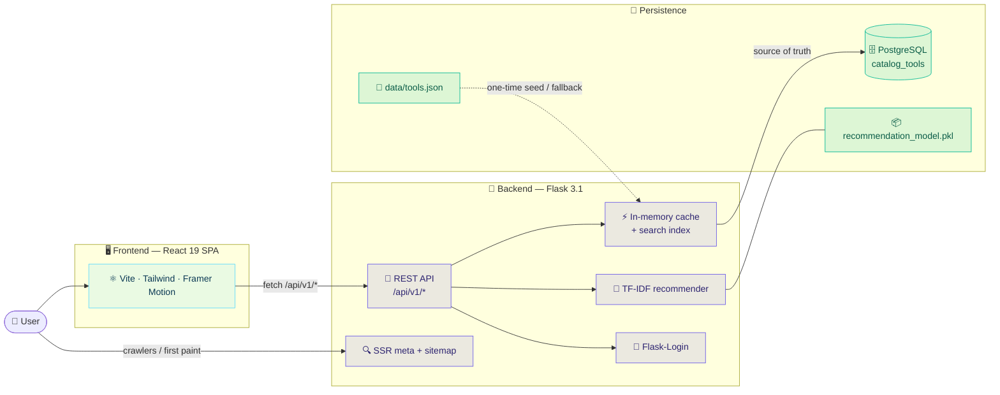
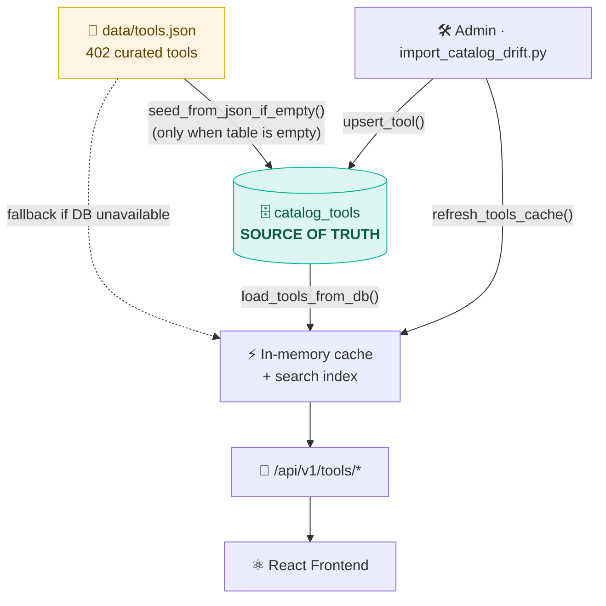
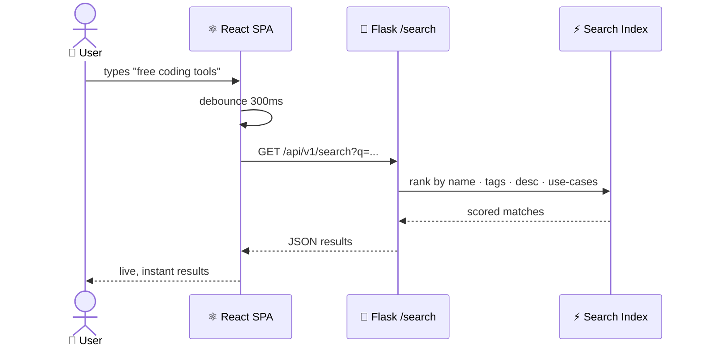
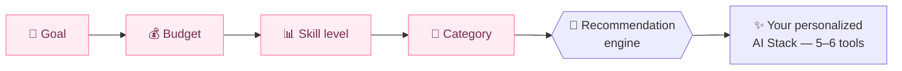
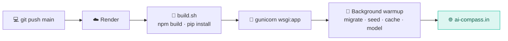
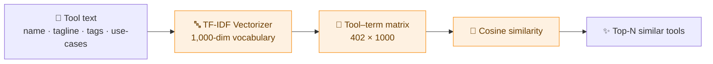

<div align="center">

# 🧭 AI Compass

### Find the *right* AI tool in seconds — not the hundredth listicle.

**A student‑first discovery engine for 400+ hand‑curated AI tools, with a smart recommendation wizard, editorial guides, and a real recommendation model under the hood.**

<br/>

[](https://ai-compass.in)
&nbsp;
[](https://ai-compass.in/tools)
&nbsp;
[](https://ai-compass.in/ai-tool-finder)

<br/>


</div>

---

## 📑 Table of Contents

- [✨ What is AI Compass?](#-what-is-ai-compass)
- [🎯 The Problem It Solves](#-the-problem-it-solves)
- [🚀 Features](#-features)
- [🏗️ Architecture](#️-architecture)
- [🔄 How It Works — The Workflows](#-how-it-works--the-workflows)
- [🛠️ Tech Stack](#️-tech-stack)
- [⚡ Quick Start](#-quick-start)
- [📁 Project Structure](#-project-structure)
- [🔌 API Reference](#-api-reference)
- [🧠 The Recommendation Engine](#-the-recommendation-engine)
- [🌐 Deployment](#-deployment)
- [🤝 Contributing](#-contributing)

---

## ✨ What is AI Compass?

**AI Compass** is a production‑grade web app that turns the overwhelming sea of AI tools into a fast, opinionated, student‑friendly experience. It pairs a **hand‑tested catalog of 402 tools across 10 categories** with a **multi‑step recommendation wizard**, **SEO editorial guides**, **ratings & reviews**, and an **admin moderation suite** — all served by a single Flask app behind a slick React SPA.

> [!NOTE]
> Every tool is **opened, used, and given a written rationale** before it ships — no scraping, no auto‑generated filler. Pricing is re‑verified on a rolling cadence.

<div align="center">

| 🧰 **402** tools | 🗂️ **10** categories | 🔌 **85** routes | 🧠 **1** real ML model |
|:---:|:---:|:---:|:---:|

</div>

---

## 🎯 The Problem It Solves

Students don't need another generic list. They need answers to three practical questions:

```
1.  Which tools are actually worth using?        →  Curated, hand-tested catalog
2.  Which ones fit a student budget?             →  Free / freemium filters + perks
3.  Which stack should I use for MY workflow?     →  AI Tool Finder + recommender
```

---

## 🚀 Features

| | Feature | What it does |
|:---:|:---|:---|
| 🔎 | **Tool Directory** | Filter & sort 400+ tools by category, pricing, and intent with live search |
| ✨ | **AI Tool Finder** | A multi‑step wizard that builds a personalized "AI stack" from your goal, budget & skill |
| 📄 | **Tool Detail Pages** | Deep dives with pricing tiers, strengths, use‑cases, ratings & **similar tools** |
| 🆚 | **Compare & Alternatives** | Side‑by‑side `X vs Y` pages + "best alternatives to ___" for every tool |
| 📚 | **Editorial Guides** | SEO landing pages — *Best AI Tools for Students / Teachers / Coding / Free* |
| ⭐ | **Ratings & Reviews** | Authenticated users rate tools and write real reviews |
| ❤️ | **Favorites & Dashboard** | Personal library + personalized greetings |
| 🧠 | **Recommendation Engine** | TF‑IDF + cosine similarity surfaces genuinely related tools |
| 🛡️ | **Admin Suite** | Moderation, catalog drift import, cache control, retraining |
| 🔍 | **SEO Built‑in** | Server‑rendered meta tags, JSON‑LD, dynamic `sitemap.xml`, OG images |

---

## 🏗️ Architecture

A single Flask application serves the API **and** the pre‑built React SPA. The catalog is **database‑backed** with an in‑memory cache in front for speed.



---

## 🔄 How It Works — The Workflows

### 1️⃣ Catalog data flow — *the source of truth*

`tools.json` is only a **one‑time seed**. Once the database is populated, **`catalog_tools` (PostgreSQL) becomes the source of truth**, and an in‑memory cache serves reads.



> [!TIP]
> Adding a tool to `tools.json` **after** the DB is seeded won't appear until it's imported. Run `python import_catalog_drift.py --apply` (or the `/admin/catalog-import/<slug>` endpoint) to sync the drift, then refresh the cache.

### 2️⃣ Live search request lifecycle



### 3️⃣ The AI Tool Finder wizard



### 4️⃣ Deploy pipeline



> [!IMPORTANT]
> Heavy startup work (cold DB connect, model load/training) runs in a **background thread** so gunicorn binds the port immediately — keeping deploys fast and within the platform's port‑scan window.

---

## 🛠️ Tech Stack

<table>
<tr><th>Layer</th><th>Technologies</th></tr>
<tr>
<td><b>🎨 Frontend</b></td>
<td>


</td>
</tr>
<tr>
<td><b>⚙️ Backend</b></td>
<td>


</td>
</tr>
<tr>
<td><b>🧠 ML / Data</b></td>
<td>


-003B57?style=flat-square&logo=sqlite&logoColor=white)

</td>
</tr>
<tr>
<td><b>☁️ Infra</b></td>
<td>


</td>
</tr>
</table>

---

## ⚡ Quick Start

> **Prerequisites:** Python 3.11+, Node 18+, and npm.

<details>
<summary><b>🔧 1. Clone & set up the backend</b></summary>

```bash
git clone https://github.com/Singhmedhansh/ai-compass.git
cd ai-compass

# create a virtualenv
python -m venv venv
source venv/bin/activate        # Windows: venv\Scripts\activate

# install Python deps
pip install -r requirements.txt
```

No `DATABASE_URL`? The app falls back to a local **SQLite** DB at `instance/ai_compass.db` and seeds it from `data/tools.json` automatically — zero config to get running.

</details>

<details>
<summary><b>🎨 2. Build the frontend</b></summary>

```bash
cd frontend
npm install
npm run build      # outputs to ../static/dist (served by Flask)
cd ..
```

For live frontend development with hot reload:

```bash
cd frontend && npm run dev
```

</details>

<details>
<summary><b>🚀 3. Run the app</b></summary>

```bash
python run.py
# → http://localhost:8080
```

Or production‑style with gunicorn:

```bash
gunicorn wsgi:app --bind 0.0.0.0:8080 --workers 1 --timeout 120
```

</details>

<details>
<summary><b>🧠 4. (Optional) Build the recommendation model</b></summary>

```bash
python scripts/train_model.py
# → writes data/recommendation_model.pkl
```

If the model file is missing, the app trains it automatically on first boot.

</details>

<details>
<summary><b>🔐 Environment variables</b></summary>

| Variable | Purpose | Default |
|:---|:---|:---|
| `DATABASE_URL` | Postgres connection string | SQLite fallback |
| `SECRET_KEY` | Flask session signing | auto‑generated |
| `PORT` | Port to bind | `8080` |
| `APP_ENV` | `production` enables hardening | dev |
| `FRONTEND_URL` / `CANONICAL_HOST` | Canonical URLs / CORS | — |
| `GOOGLE_CLIENT_ID` / `GITHUB_CLIENT_ID` | Social login (optional) | — |

</details>

---

## 📁 Project Structure

<details>
<summary><b>Click to expand the tree</b></summary>

```
ai-compass/
├── app/                       # 🐍 Flask application package
│   ├── __init__.py            #    app factory + background warmup
│   ├── routes.py              #    SSR shell, SEO meta, sitemap, redirects
│   ├── api_routes.py          #    REST API (/api/v1/*) + admin endpoints
│   ├── tool_cache.py          #    in-memory cache + search index
│   ├── catalog_store.py       #    DB catalog: seed / upsert / load
│   ├── ml_recommender.py      #    TF-IDF similarity engine
│   ├── search_utils.py        #    search ranking
│   └── models.py              #    SQLAlchemy models
├── frontend/                  # ⚛️ React 19 + Vite SPA
│   └── src/
│       ├── pages/             #    routes (Directory, ToolDetail, Finder, guides…)
│       ├── components/        #    UI components
│       └── assets/brand/      #    self-hosted brand logos
├── data/
│   ├── tools.json             # 📄 curated catalog (seed source)
│   └── recommendation_model.pkl
├── scripts/                   # 🛠️ trainers, migrations, catalog tools
├── import_catalog_drift.py    #    sync tools.json → DB catalog
├── migrations/                #    Alembic migrations
├── wsgi.py / run.py           #    entry points
├── render.yaml / Procfile / Dockerfile
└── requirements.txt
```

</details>

---

## 🔌 API Reference

<details>
<summary><b>Public endpoints</b></summary>

| Method | Endpoint | Description |
|:---|:---|:---|
| `GET` | `/api/v1/tools` | List all visible tools |
| `GET` | `/api/v1/tools/<slug>` | Single tool + similar tools + ratings |
| `GET` | `/api/v1/tools/<slug>/alternatives` | Best alternatives |
| `GET` | `/api/v1/tools/<slug>/reviews` | User reviews |
| `GET` | `/api/v1/search?q=` | Live search (name · tags · desc · use‑cases) |
| `GET` | `/api/v1/stats` | Catalog stats (total tools, etc.) |
| `GET` | `/sitemap.xml` | Dynamic SEO sitemap |
| `GET` | `/health` | Health check |

</details>

<details>
<summary><b>Authenticated & admin endpoints</b></summary>

| Method | Endpoint | Description |
|:---|:---|:---|
| `POST` | `/api/v1/tools/<slug>/ratings` | Rate a tool |
| `POST` | `/api/v1/tools/<slug>/reviews` | Write a review |
| `GET` | `/api/v1/favorites` | List favorites |
| `GET` | `/api/v1/admin/catalog-diff` | Drift between `tools.json` and the DB |
| `POST` | `/api/v1/admin/catalog-import/<slug>` | Import a tool into the DB |
| `POST` | `/api/v1/admin/clear-cache` | Reload catalog cache from source |
| `POST` | `/api/v1/admin/retrain` | Rebuild the recommendation model |

</details>

---

## 🧠 The Recommendation Engine

A lightweight, fully self‑contained **content‑based** recommender — no external API, no vendor lock‑in.



1. Every tool's text is vectorized with **TF‑IDF** (scikit‑learn).
2. **Cosine similarity** ranks the closest tools.
3. Results power **"Similar tools"**, **alternatives pages**, and the **AI Tool Finder**.
4. Retrain anytime with `python scripts/train_model.py` or the `/admin/retrain` endpoint.

---

## 🌐 Deployment

Deployed on **Render** (web service + managed **Neon** Postgres).

```bash
# Build  →  npm run build (frontend)  +  pip install (backend)   [build.sh]
# Start  →  gunicorn wsgi:app --bind 0.0.0.0:$PORT --workers 1 --timeout 120
```

- `render.yaml` declares the service, build/start commands, and env wiring.
- A `Dockerfile` is also provided for container‑based hosting (Fly.io, etc.).
- DB schema is migrated via **Flask‑Migrate / Alembic** during warmup.

---

## 🤝 Contributing

Contributions welcome! A good first PR:

1. **Fork** & branch (`git checkout -b feat/my-improvement`).
2. Add or refine a tool in `data/tools.json` (follow the existing schema).
3. Run `python import_catalog_drift.py --apply` to sync it into the DB locally.
4. `cd frontend && npm run lint` and verify the app boots (`python run.py`).
5. Open a PR with a clear description.

> [!NOTE]
> The catalog is **DB‑backed in production** — `tools.json` edits need an import step to go live. See [Catalog data flow](#1️⃣-catalog-data-flow--the-source-of-truth).

---

<div align="center">

### Built for students. Curated by humans. Powered by Flask + React.

**[🌐 Live Site](https://ai-compass.in)** · **[🔎 Browse Tools](https://ai-compass.in/tools)** · **[✨ AI Tool Finder](https://ai-compass.in/ai-tool-finder)**

<sub>Crafted by <a href="https://github.com/Singhmedhansh">Medhansh Pratap Singh</a> · Made with 🧭</sub>

</div>
